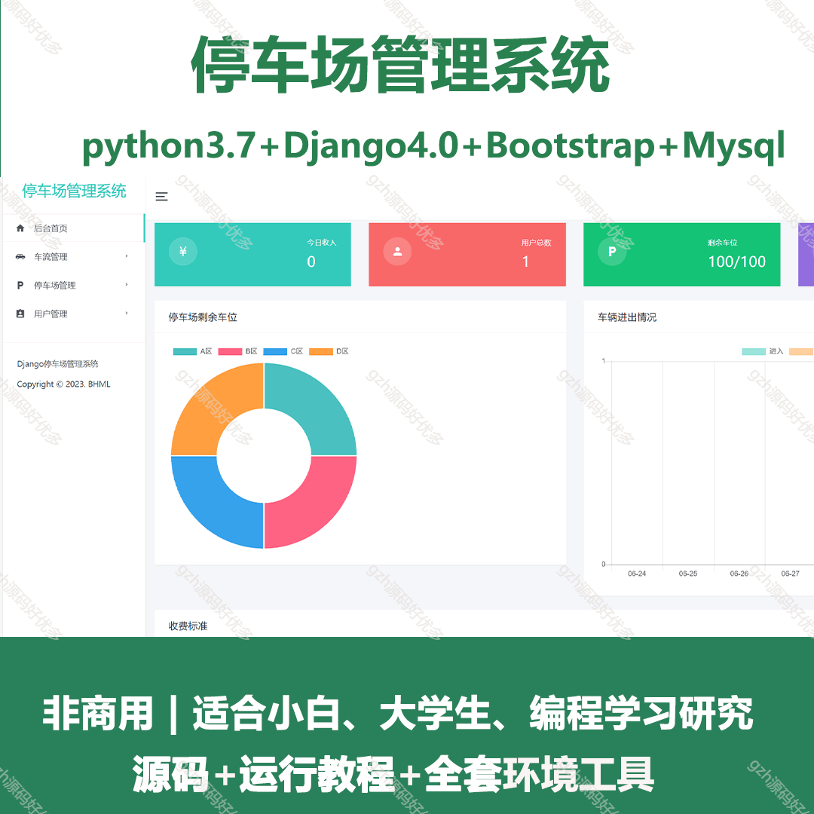
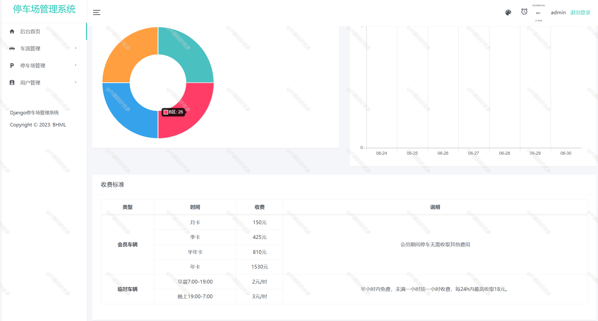
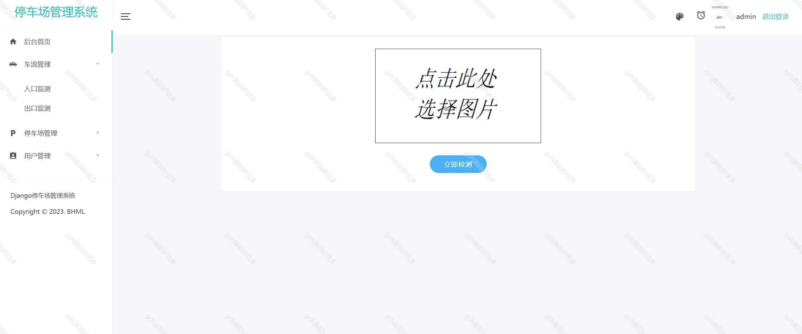
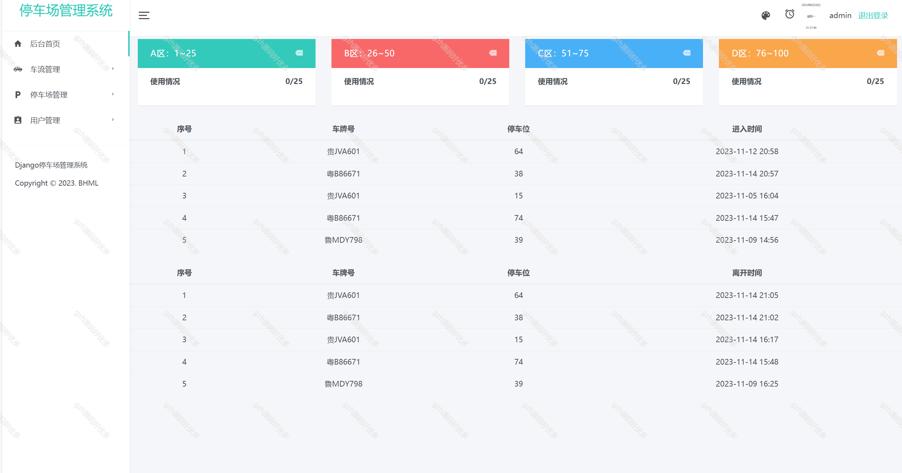
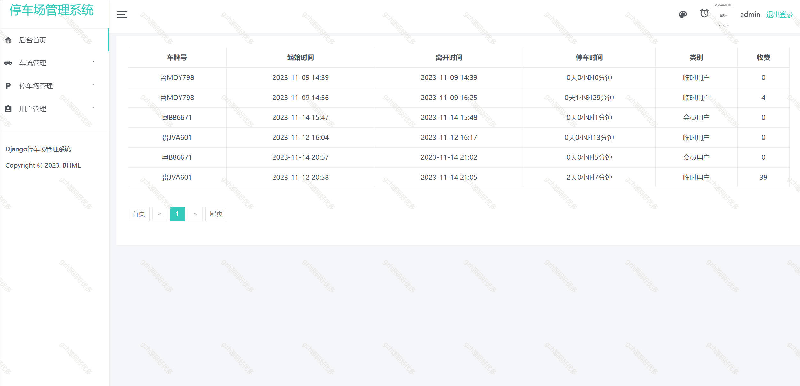
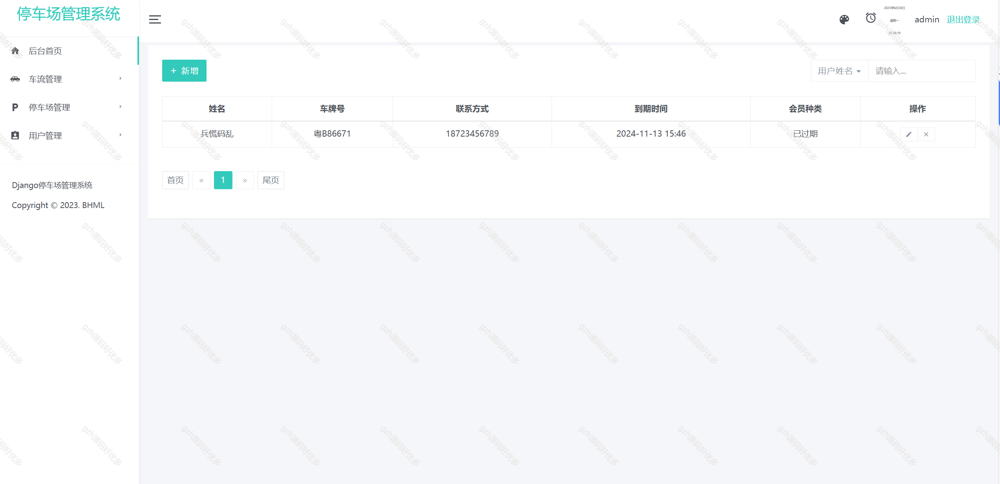
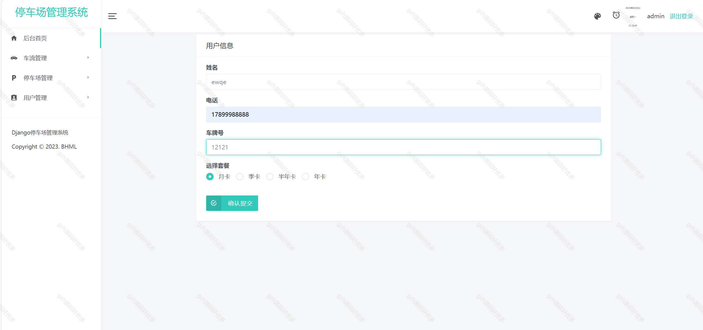
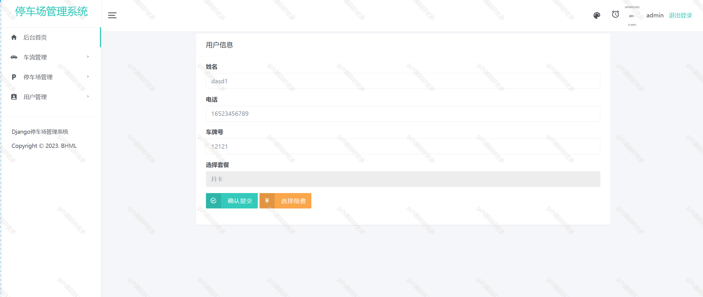

# python043
python043基于Python+Django的停车场管理系统
 
## 查看主页获取源码

### 一、关键词

停车管理系统，停车系统

 

### 二、作品包含

源码+全套环境和工具资源+部署教程

 

### 三、项目技术

前端技术：Bootstrap + html，css
后端技术：Python3.7、Django4.0
  

 

### 四、运行环境（以下版本亲测，其他版本未知，请自测）

开发工具：PyCharm 

数据库：MySQL8

数据库管理工具：Navicat10+

Python3.7

浏览器：谷歌浏览器

 

### 五、项目介绍

项目编号：python043

本项目是一个基于 Django + Bootstrap 开发的停车管理系统，主要用于管理停车场、相关业务。

主要功能
1、车辆出入百度api车牌识别
2、停车费计算，车位管理，会员卡办理等

 

### 六、运行截图

